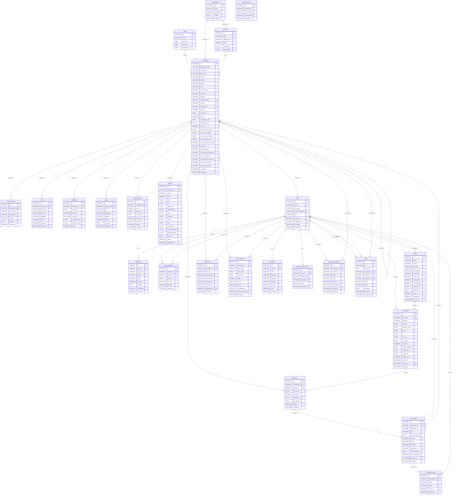

# Entity-Relationship Diagram

```mermaid
erDiagram
    departments ||--o{ job_roles : "department_id"
    employees ||--o{ employees : "manager_id"
    shifts ||--o{ employees : "shift_id"
    departments ||--o{ employees : "department_id"
    job_roles ||--o{ employees : "role_id"
    employees ||--o{ activity_events : "employee_id"
    employees ||--o{ alerts : "employee_id"
    employees ||--o{ attendance : "employee_id"
    employees ||--o{ goals : "employee_id"
    employees ||--o{ monitoring_logs : "employee_id"
    employees ||--o{ payroll : "employee_id"
    employees ||--o{ users : "employee_id"
    users ||--o{ audit_logs : "user_id"
    users ||--o{ chat_messages : "sender_id"
    users ||--o{ chat_messages : "receiver_id"
    users ||--o{ datasets : "uploaded_by"
    employees ||--o{ documents : "employee_id"
    users ||--o{ documents : "uploaded_by"
    employees ||--o{ leave_requests : "employee_id"
    users ||--o{ leave_requests : "reviewed_by"
    users ||--o{ notifications : "user_id"
    users ||--o{ password_reset_tokens : "user_id"
    users ||--o{ performance_reviews : "reviewer_id"
    employees ||--o{ performance_reviews : "employee_id"
    users ||--o{ tasks : "created_by"
    users ||--o{ tasks : "assigned_to"
    employees ||--o{ tasks : "employee_id"
    users ||--o{ ml_models : "trained_by"
    datasets ||--o{ ml_models : "dataset_id"
    employees ||--o{ predictions : "employee_id"
    ml_models ||--o{ predictions : "model_id"
    predictions ||--o{ interventions : "prediction_id"
    users ||--o{ interventions : "assigned_to"
    employees ||--o{ interventions : "employee_id"
    interventions ||--o{ intervention_logs : "intervention_id"
    users ||--o{ intervention_logs : "user_id"
    departments {
        INTEGER id PK
        VARCHAR name
        VARCHAR description
        FLOAT budget
        DATETIME created_at
    }
    leave_policies {
        INTEGER id PK
        VARCHAR leave_type
        INTEGER annual_quota
        BOOLEAN carry_forward
        VARCHAR description
    }
    shifts {
        INTEGER id PK
        VARCHAR name
        TIME start_time
        TIME end_time
        FLOAT standard_hours
    }
    job_roles {
        INTEGER id PK
        VARCHAR title
        INTEGER department_id FK
        INTEGER level
        FLOAT min_salary
        FLOAT max_salary
    }
    employees {
        INTEGER id PK
        VARCHAR employee_code
        VARCHAR first_name
        VARCHAR last_name
        VARCHAR email
        VARCHAR phone
        VARCHAR gender
        INTEGER age
        VARCHAR marital_status
        INTEGER education
        VARCHAR address
        INTEGER department_id FK
        INTEGER role_id FK
        INTEGER manager_id FK
        INTEGER shift_id FK
        DATE hire_date
        VARCHAR status
        DATE termination_date
        FLOAT monthly_salary
        INTEGER job_level
        FLOAT distance_from_home
        FLOAT years_at_company
        FLOAT years_since_promotion
        FLOAT total_working_years
        INTEGER num_companies_worked
        BOOLEAN overtime
        INTEGER job_satisfaction
        INTEGER environment_satisfaction
        INTEGER work_life_balance
        INTEGER training_times_last_year
        INTEGER performance_rating
        INTEGER stock_option_level
        DATETIME created_at
        DATETIME updated_at
    }
    activity_events {
        INTEGER id PK
        INTEGER employee_id FK
        VARCHAR event_type
        VARCHAR description
        VARCHAR severity
        JSON payload
        DATETIME created_at
    }
    alerts {
        INTEGER id PK
        INTEGER employee_id FK
        VARCHAR alert_type
        VARCHAR severity
        VARCHAR message
        VARCHAR status
        DATETIME created_at
        DATETIME resolved_at
    }
    attendance {
        INTEGER id PK
        INTEGER employee_id FK
        DATE work_date
        DATETIME check_in
        DATETIME check_out
        FLOAT working_hours
        FLOAT overtime_hours
        VARCHAR status
    }
    goals {
        INTEGER id PK
        INTEGER employee_id FK
        VARCHAR title
        VARCHAR description
        INTEGER progress
        VARCHAR status
        DATE due_date
        DATETIME created_at
    }
    monitoring_logs {
        INTEGER id PK
        INTEGER employee_id FK
        VARCHAR event
        FLOAT old_score
        FLOAT new_score
        VARCHAR old_level
        VARCHAR new_level
        VARCHAR trigger
        DATETIME created_at
    }
    payroll {
        INTEGER id PK
        INTEGER employee_id FK
        INTEGER month
        INTEGER year
        FLOAT basic
        FLOAT hra
        FLOAT allowances
        FLOAT overtime_pay
        FLOAT bonus
        FLOAT incentive
        FLOAT gross
        FLOAT tax
        FLOAT pf_deduction
        FLOAT other_deductions
        FLOAT total_deductions
        FLOAT net_pay
        VARCHAR status
        DATETIME generated_at
    }
    users {
        INTEGER id PK
        VARCHAR email
        VARCHAR full_name
        VARCHAR hashed_password
        VARCHAR role
        BOOLEAN is_active
        INTEGER employee_id FK
        DATETIME last_login
        DATETIME created_at
    }
    audit_logs {
        INTEGER id PK
        INTEGER user_id FK
        VARCHAR user_email
        VARCHAR action
        VARCHAR entity
        VARCHAR entity_id
        JSON changes
        VARCHAR ip_address
        DATETIME created_at
    }
    chat_messages {
        INTEGER id PK
        INTEGER sender_id FK
        INTEGER receiver_id FK
        TEXT content
        BOOLEAN is_read
        DATETIME read_at
        DATETIME created_at
    }
    datasets {
        INTEGER id PK
        VARCHAR name
        INTEGER version
        VARCHAR filename
        VARCHAR stored_path
        INTEGER rows_total
        INTEGER rows_valid
        INTEGER rows_failed
        INTEGER rows_duplicate
        FLOAT attrition_rate
        JSON failed_report
        VARCHAR status
        INTEGER uploaded_by FK
        DATETIME created_at
    }
    documents {
        INTEGER id PK
        INTEGER employee_id FK
        VARCHAR doc_type
        VARCHAR original_name
        VARCHAR stored_name
        VARCHAR content_type
        INTEGER size_bytes
        INTEGER uploaded_by FK
        DATETIME created_at
    }
    leave_requests {
        INTEGER id PK
        INTEGER employee_id FK
        VARCHAR leave_type
        DATE start_date
        DATE end_date
        INTEGER days
        VARCHAR reason
        VARCHAR status
        INTEGER reviewed_by FK
        VARCHAR review_comment
        DATETIME created_at
    }
    notifications {
        INTEGER id PK
        INTEGER user_id FK
        VARCHAR title
        VARCHAR message
        VARCHAR category
        VARCHAR priority
        BOOLEAN is_read
        VARCHAR link
        DATETIME created_at
    }
    password_reset_tokens {
        INTEGER id PK
        INTEGER user_id FK
        VARCHAR token_hash
        DATETIME expires_at
        BOOLEAN used
        DATETIME created_at
    }
    performance_reviews {
        INTEGER id PK
        INTEGER employee_id FK
        INTEGER reviewer_id FK
        VARCHAR period
        INTEGER rating
        VARCHAR strengths
        VARCHAR improvements
        VARCHAR comments
        DATETIME created_at
    }
    tasks {
        INTEGER id PK
        VARCHAR title
        TEXT description
        INTEGER assigned_to FK
        INTEGER created_by FK
        INTEGER employee_id FK
        VARCHAR priority
        VARCHAR status
        DATE due_date
        DATETIME created_at
        DATETIME completed_at
    }
    ml_models {
        INTEGER id PK
        INTEGER dataset_id FK
        VARCHAR algorithm
        FLOAT accuracy
        FLOAT precision_score
        FLOAT recall
        FLOAT f1
        FLOAT roc_auc
        FLOAT cv_roc_auc
        INTEGER train_rows
        JSON feature_importance
        JSON comparison
        JSON confusion
        VARCHAR artifact_path
        BOOLEAN is_active
        INTEGER trained_by FK
        DATETIME created_at
    }
    predictions {
        INTEGER id PK
        INTEGER employee_id FK
        INTEGER model_id FK
        FLOAT risk_score
        VARCHAR risk_level
        FLOAT confidence
        JSON top_factors
        VARCHAR trigger
        DATETIME created_at
    }
    interventions {
        INTEGER id PK
        INTEGER employee_id FK
        INTEGER prediction_id FK
        VARCHAR title
        TEXT recommendation
        VARCHAR priority
        VARCHAR status
        VARCHAR outcome
        INTEGER assigned_to FK
        DATE follow_up_date
        BOOLEAN auto_generated
        DATETIME created_at
        DATETIME closed_at
    }
    intervention_logs {
        INTEGER id PK
        INTEGER intervention_id FK
        VARCHAR action
        VARCHAR note
        INTEGER user_id FK
        DATETIME created_at
    }
```